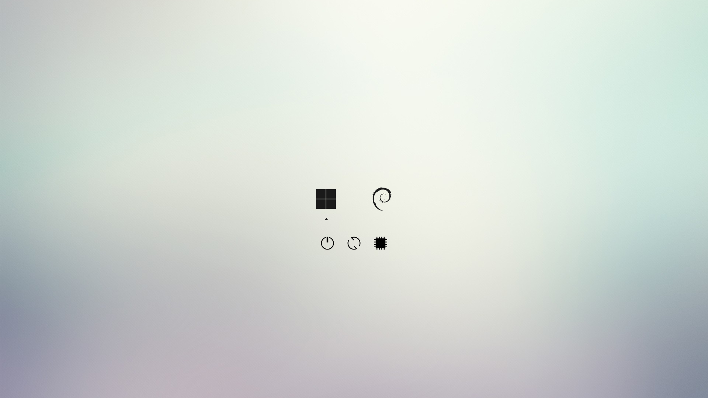
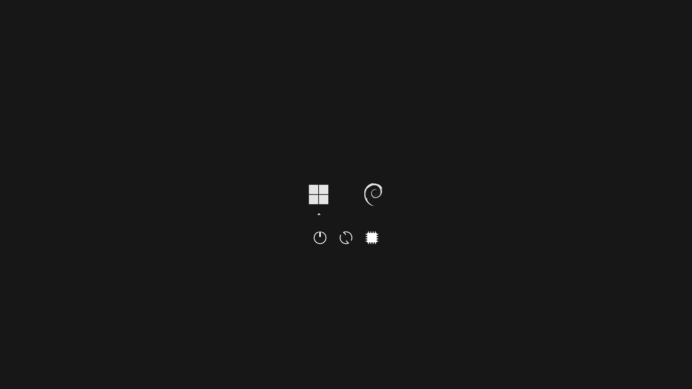

# rEFInd Minimal Themes

[rEFInd](http://www.rodsbooks.com/refind/) is a boot manager for UEFI based systems. These are a clean and minimal themes for it.

>NOTE: This theme is forked of [rEFInd-minimal-themes](https://github.com/quantrancse/rEFInd-minimal-themes) by [quantrancse](https://github.com/quantrancse).
>>The original themes was based on the 2013 theme by [Evan Purkhiser][evan] with some modifications and additional dark theme.

There are two variants of this theme i liked these are:

## Light Theme



## Dark Theme



## Installation

Fork this repository to you local directory by running the following command in terminal.

```bash
git clone https://github.com/iammrmehedi/rEFInd-Minimal-Themes.git
```

## Usage

1. Locate your refind EFI directory. This is commonly `/boot/EFI/refind`
    though it will depend on where you mount your ESP and where rEFInd is
    installed. `fdisk -l` and `mount` may help.

2. Create a folder called `themes` inside it, if it doesn't already exist

3. Clone this repository into the `themes` directory.

4. To enable the theme add the following line at the end of `refind.conf`.

 ```nginx
include themes/rEFInd-minimal-(light or dark)/theme.conf
 ```

Here's an example menuentry configuration (from the screenshot):

```nginx
menuentry "Windows_11" {
   icon /EFI/refind/themes/rEFInd-minimal-(light or dark)/icons/os_win11.png
   loader /EFI/Microsoft/Boot/bootmgfw.efi
}

menuentry "Debian" {
    icon /EFI/refind/themes/rEFInd-minimal-(light or dark)/icons/os_debian.png
    volume 53f60ca1-c118-4885-b66b-3f29039e5a43
    loader /boot/vmlinuz-6.1.0-9-amd64
    initrd /boot/initrd.img-6.1.0-9-amd64
    options "root=UUID=60ebb4c2-e9e3-4ba4-a0a8-f662d51d8b4d ro quiet nomodeset mitigations=off "
}
```

Entries that are autodetected should also show the proper icons.

* For the `volume` token`(PARTUUID)` and `UUID`, use `sudo blkid` to find it.
* For the `loader` and `initrd` file names, use `ls /boot/`

Read more about rEFInd configuration at [this link][refind-config]

### Background sizes

If you find the background looks blurry it may be due to the included wallpaper being an incorrect resolution for your monitor. You can download the [original high quality wallpaper][wallpaper], resize it as appropriate, and replace the `background_(dark or light).png`.

* You can of course also choose your own background!

### Attribution

The OS icons are from [Lightness for burg][icons] by [SWOriginal][icon-author].

The OS icons color of dark theme  was colorized by [quantrancse](https://github.com/quantrancse).

The light background is [Minimalist Wallpaper][wallpaper] by [LeonardoAIanB][wallpaper-author].

[evan]: https://github.com/EvanPurkhiser/rEFInd-minimal
[icons]: http://sworiginal.deviantart.com/art/Lightness-for-burg-181461810
[icon-author]: http://sworiginal.deviantart.com/

[wallpaper]: http://leonardoalanb.deviantart.com/art/Minimalist-wallpaper-295519786
[wallpaper-author]: http://leonardoalanb.deviantart.com/
[refind-config]: https://www.rodsbooks.com/refind/configfile.html
